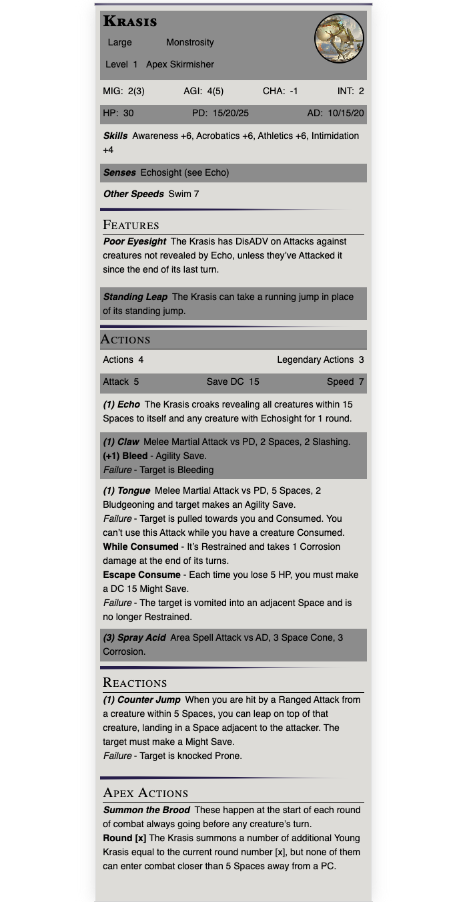

## About
A location for anything related to obsidian

### DC20 Statblock
I've been playing with the Fantasy stat block plug in and created a simple statblock for DC20. 
- DC20.json: The file to import into your Obsidian vault
- krasis.yaml: An example of the statblock using an animal from The Hunted free one-shot
- Krasis.png: How the statblock looks when rednderd in Obsidian

